# Metacognitive Fund Strategy Stack
### Project README

> **Stack:** Python 3.10+ · SMSE (Physarum lattice) · Qwen2.5-Coder-1.5B + QLoRA · Qdrant · MAS · Hybrid SSM–MoE (parallel track)  
> **Approach:** Combinatorial strategy discovery with adversarial Prover labeling, memory-grounded RAG, and closed-loop corpus flywheel  
> **Current milestone:** Phase 1C gate met (505+ distinct) · QLoRA checkpoint trained on Colab · Phase 3 LLM sweeps in progress

**Related docs:** [SPEC.md](SPEC.md) (full system specification) · [PHASES.md](PHASES.md) (phase roadmap) · [docs/HYBRID_PHASES.md](docs/HYBRID_PHASES.md) (parallel hybrid track)

---

## Table of Contents

1. [Overview](#1-overview)
2. [Quick Start](#2-quick-start)
3. [The Problem](#3-the-problem)
4. [The Solution](#4-the-solution)
5. [System Architecture](#5-system-architecture)
6. [Strategy Generation Pipelines](#6-strategy-generation-pipelines)
7. [The Adversarial Prover Layer](#7-the-adversarial-prover-layer)
8. [The Corpus Flywheel & Self-Correcting Loop](#8-the-corpus-flywheel--self-correcting-loop)
9. [Memory Store & RAG System](#9-memory-store--rag-system)
10. [Training & Evaluation Pipeline](#10-training--evaluation-pipeline)
11. [MAS Integration & Shadow Matrix](#11-mas-integration--shadow-matrix)
12. [Hybrid SSM–MoE Track (Parallel)](#12-hybrid-ssmmoe-track-parallel)
13. [End-to-End Workflows](#13-end-to-end-workflows)
14. [Development & Compute Stack](#14-development--compute-stack)
15. [Local Development Considerations](#15-local-development-considerations)
16. [Anti-Cheat & Prover ≠ Alpha Hardening](#16-anti-cheat--prover--alpha-hardening)
17. [Design Decisions](#17-design-decisions)
18. [Current Status & Next Steps](#18-current-status--next-steps)

---

## 1. Overview

This monorepo is a **research and training platform** for discovering, validating, and learning to generate **regime-conditioned trading strategies** in a restricted Python DSL (`BaseMarketStrategy`). The goal is not to deploy hundreds of live strategies at the corpus gate — it is to build a **labeled textbook** of what survives adversarial backtests, then fine-tune generators to compose within that grammar.

Five layers work together:

| Layer | Package | Role |
|-------|---------|------|
| **SMSE** | `packages/smse/` | Combinatorial lattice path finder — no LLM required |
| **Prover** | `packages/smse/` | Walk-forward backtester, regime Sharpe gates, novelty detection |
| **FinMem** | `packages/metacog/` | Qdrant memory (`passed` / `failed` / `died_live`) + RAG |
| **Metacog** | `packages/metacog/` | Qwen2.5-Coder + QLoRA generation, confidence head, MCP |
| **MAS** | `packages/mas/` | Sleeve registration, shadow paper-trading, retirement rules |

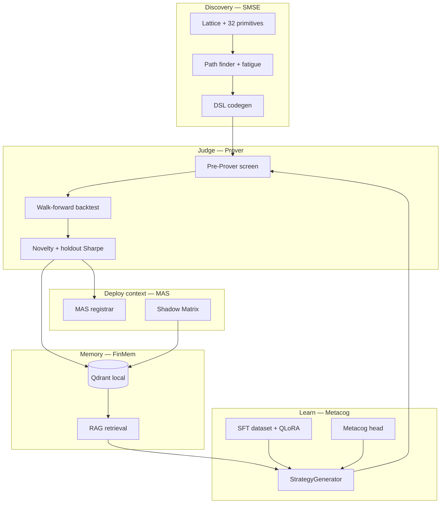

### Regime Taxonomy

| ID | Regime | Sweep role |
|----|--------|------------|
| **HVC** | HighVol_Contraction | Hardest pass rate; ~3 passes/sweep |
| **LVE** | LowVol_Expansion | Primary corpus growth driver |
| **LC** | Liquidity_Crisis | Crisis primitives; moderate volume |

---

## 2. Quick Start

### Prerequisites

- Python **3.10+** (3.11–3.14 tested)
- **8 GB RAM minimum** for SMSE sweeps; **24–32 GB** recommended for local LoRA inference
- **GPU optional on Mac** — QLoRA train and full eval run on **Colab A100**

### Install

```bash
cd /path/to/LLM
python3 -m venv .venv
source .venv/bin/activate
make install                    # pip install -e ".[dev,smse]"
make verify && make bootstrap   # memory schema + e2e smoke test
```

For LoRA train/eval locally (heavy):

```bash
.venv/bin/pip install -e ".[train]"
```

### Run the flywheel (corpus growth)

```bash
make flywheel          # sweep-x3 → corpus-report → sft-dataset → verify → baseline
make corpus-report     # check gates
cat data/corpus_report.json
```

### Train LoRA (Colab — recommended)

```bash
make sft-dataset         # stop sweeps first — Qdrant must be unlocked
make colab-upload-pack   # builds colab_upload/metacog_repo.zip + bundle
```

Open [`training/colab/phase2_lora_train.ipynb`](training/colab/phase2_lora_train.ipynb) on Colab A100. After training, download the bundle and import:

```bash
.venv/bin/python scripts/colab_data_sync.py import --bundle data/colab_export/<bundle>.tar.gz
make enable-lora
```

### Evaluate checkpoint

| Command | When to use |
|---------|-------------|
| `make eval-checkpoint-quick` | Mac with 8–16 GB — light battery |
| `make eval-checkpoint-compile` | Compile-only sanity check |
| Colab [`phase2_lora_eval.ipynb`](training/colab/phase2_lora_eval.ipynb) | Full Prover + holdout eval on GPU |

### Weekly rhythm

```bash
make weekly   # flywheel + train-metacog
```

---

## 3. The Problem

Quantitative strategy research fails in three coupled ways:

**Discovery bottleneck.** Hand-writing regime-specific strategies does not scale. Unstructured LLM output produces syntax errors, lookahead bugs, and untradeable noise.

**Validation gap (Prover ≠ Alpha).** In-sample Sharpe is a weak proxy for live survival. Strategies pass by overfitting or exploiting leaky features. A corpus of "passed" labels is worthless if the labeler is gamed.

**Knowledge retention.** Without persistent memory, each sweep rediscovers the same paths. Without anti-cheat splits, fine-tuned LLMs memorize SMSE paths instead of learning the DSL.

This project treats **labeled strategy code** as the central artifact.

---

## 4. The Solution

A **gated flywheel** connects combinatorial search to learned generation:

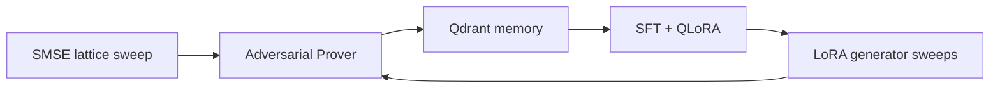

1. **SMSE** explores a bounded primitive lattice (32 nodes, max 3 primitives/path) with path fatigue and diversity quotas.
2. **Prover** labels each candidate with regime Sharpe, drawdown, holdout windows, and failure codes.
3. **Memory** stores outcomes in three FinMem buckets with behavioral fingerprints.
4. **SFT + QLoRA** trains on Prover-**passed** examples only, with purged time splits and 20% name holdout.
5. **LoRA generator** produces `source: llm` strategies that must pass the same Prover gates.

> **Core design decision:** The LLM does **not** invent finance from scratch. SMSE provides ground-truth DSL examples; the model learns to **compose within the grammar** under Prover supervision.

---

## 5. System Architecture

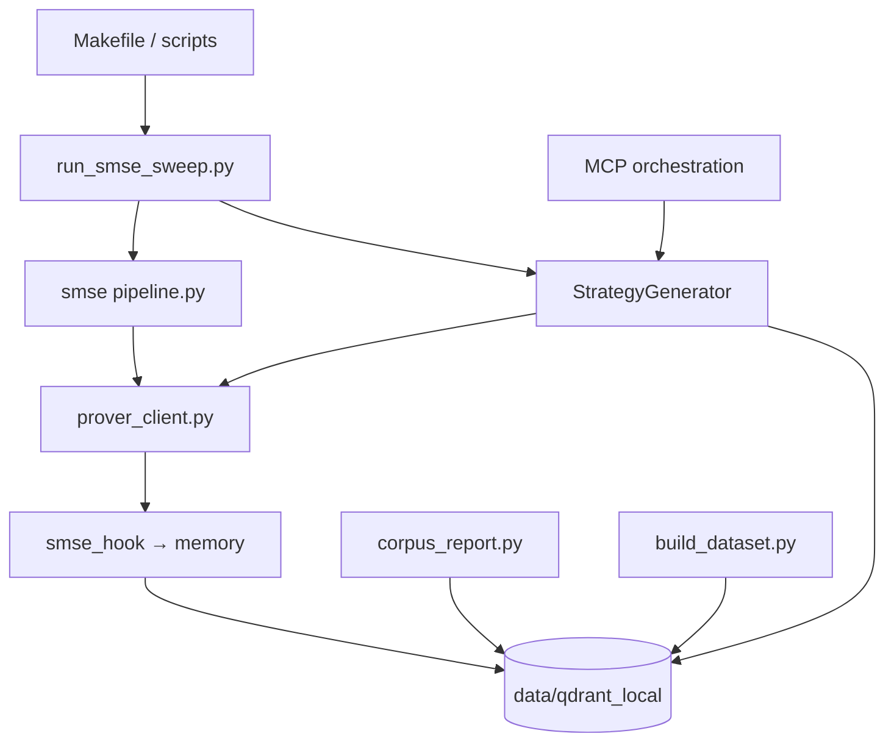

### Monorepo Layout

```
LLM/
├── packages/
│   ├── smse/               # Lattice, primitives, codegen, Prover, pipeline
│   ├── metacog/            # Memory, generation, decoding, metacog head, MCP
│   └── mas/                # Allocation, shadow matrix, retirement rules
├── hybrid-core/            # SSM encoder, MoE transformer (parallel track)
├── training/
│   ├── sft/                # build_dataset, train_lora, eval_checkpoint
│   ├── metacog/            # Confidence head training
│   └── colab/              # Colab notebooks (flywheel, LoRA train/eval)
├── scripts/                # Sweeps, corpus-report, Colab sync, verify
├── configs/                # sweep, memory, training, generator yaml
├── data/
│   ├── qdrant_local/       # Persistent memory (default)
│   ├── corpus_report.json
│   ├── sft_dataset.jsonl
│   └── checkpoints/lora_sft/
├── SPEC.md                 # Full system specification
├── PHASES.md               # Phase roadmap with gates
└── Makefile
```

### Data Flow

| Connection | Mechanism | Purpose |
|------------|-----------|---------|
| Sweep → Pipeline | `run_pipeline(regime)` | One regime config per sweep |
| Pipeline → Prover | `run_prover_check(code)` | Adversarial label + metrics |
| Prover → Memory | `upsert_from_prover_result` | Payload schema v1.0.0 |
| Memory → SFT | `scroll_all` + bucket filter | Passed-only JSONL |
| Memory → Generator | `StrategyRetriever` RAG | passed / failed / died_live context |
| Colab ↔ Mac | `colab_data_sync.py` tarball | Qdrant + SFT + checkpoint round-trip |

---

## 6. Strategy Generation Pipelines

Three backends — set in [`configs/generator.yaml`](configs/generator.yaml):

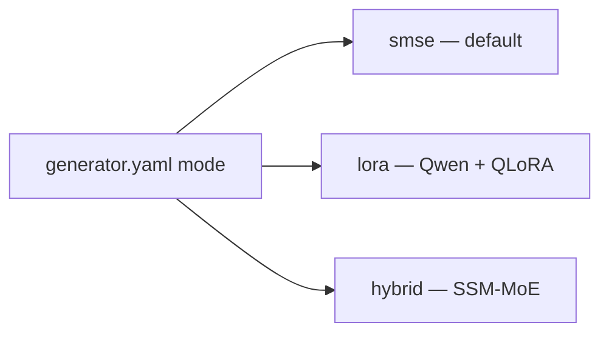

### SMSE (combinatorial — primary corpus growth)

```bash
make sweep       # one round: HVC + LVE + LC
make sweep-x3    # three rounds — faster growth
```

Flow: lattice paths → `codegen.py` → pre-Prover screen → Prover → Qdrant.

Key files: `packages/smse/src/path_finder.py`, `codegen.py`, `pre_prover_screen.py`, `prover_client.py`

Sweep parameters: [`configs/sweep_configs.yaml`](configs/sweep_configs.yaml)

### LoRA (Phase 2–3)

**Model:** `Qwen/Qwen2.5-Coder-1.5B-Instruct` + adapter at `data/checkpoints/lora_sft/`

`StrategyGenerator` auto-selects mode:

| Mode | Condition | Behavior |
|------|-----------|----------|
| `stub` | No checkpoint or missing `peft` | Minimal valid DSL placeholder |
| `lora` | `adapter_config.json` exists + train deps | RAG prompt → completion |
| `hybrid` | `mode: hybrid` in yaml | `HybridEngine.generate_strategy` |

```bash
make enable-lora    # set generator.yaml → lora
```

### Hybrid (parallel — does not block LoRA path)

See [Section 12](#12-hybrid-ssmmoe-track-parallel). Switch when holdout eval beats LoRA: `make enable-hybrid`.

---

## 7. The Adversarial Prover Layer

The Prover is the **single source of truth** for the `passed` bucket.

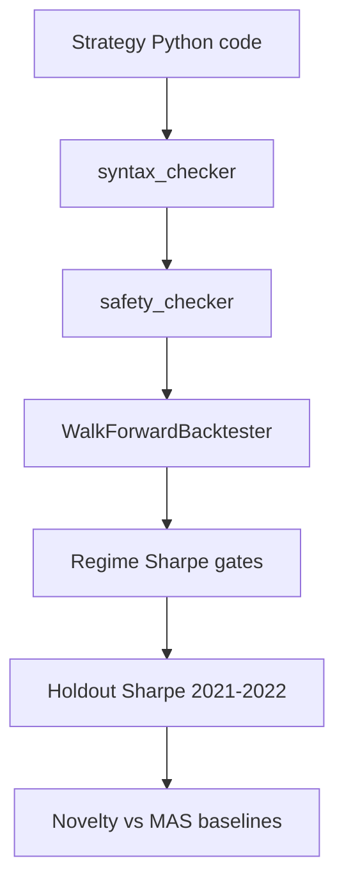

**Config:** [`packages/smse/configs/prover_config.yaml`](packages/smse/configs/prover_config.yaml)

| Threshold | Typical value |
|-----------|---------------|
| `overall_sharpe` | ≥ 0.0 |
| `holdout_sharpe` | ≥ 0.15 (regime-specific) |
| `max_drawdown_pct` | ≤ 35% |
| `novelty_score` | ≤ 0.92 similarity |

**Pre-Prover screen** (fast gate before expensive backtests): syntax, session fingerprint, Qdrant memory similarity — rejects duplicates early (~3–5× cost reduction).

Optional hardening (default **OFF** during corpus growth): deflated Sharpe, regime friction, transition stress, `died_live` fingerprint screen. Enable one flag at a time post-gate.

---

## 8. The Corpus Flywheel & Self-Correcting Loop

The operating rhythm: grow corpus → report → sync SFT → verify → train → eval → sweep with LLM.

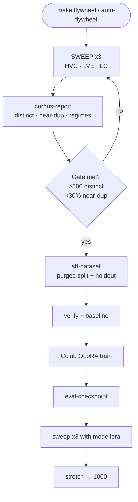

### Gate Metrics

| Metric | Target | Current (Jun 2025) |
|--------|--------|---------------------|
| `distinct_names` | ≥ 500 (stretch 1,000) | **518** |
| `near_duplicate_pct` | < 30% | **2.46%** |
| `code_pairwise_dissimilarity` | ≥ 0.20 | **0.253** |
| `prover_pass_rate` | informational | ~11% |

```bash
make corpus-report
cat data/corpus_report.json
```

**LVE stall recovery:** `make recover-lve` — decays edge toxins before LVE sweeps (auto in multi-round flywheel).

**Auto loop until gate:**

```bash
make auto-flywheel   # loops sweep-x3 + corpus-report until TARGET (default 500)
```

---

## 9. Memory Store & RAG System

FinMem uses a **frozen schema v1.0.0** Qdrant collection with three Prover buckets.

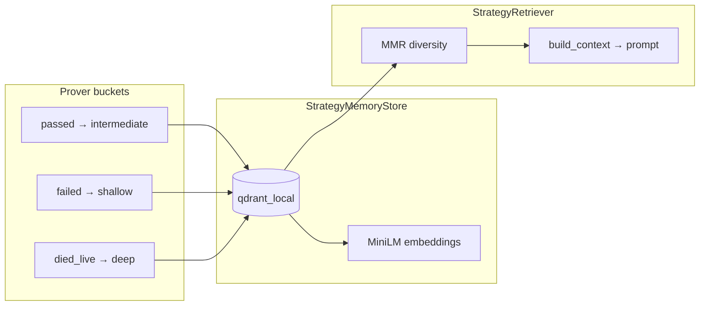

### Storage Modes

| Mode | Command / path | Use |
|------|----------------|-----|
| **Local persistent** | `data/qdrant_local/` | **Default** — no Docker |
| Docker Qdrant | `make qdrant` | Payload indexes at scale |
| In-memory | tests only | `make verify` |

### Retrieval Config

[`configs/memory.yaml`](configs/memory.yaml) — `passed_k: 5`, `failed_k: 3`, `died_live_k: 2`. Failed and died_live examples feed **self-correction** on retry.

### Important: Qdrant Lock

Stop sweeps before rebuilding SFT:

```bash
# Stop auto-flywheel / sweep first, then:
make sft-dataset
```

---

## 10. Training & Evaluation Pipeline

### SFT Dataset

[`training/sft/build_dataset.py`](training/sft/build_dataset.py)

| Feature | Detail |
|---------|--------|
| Source | `prover_bucket == passed` only |
| Name holdout | 20% deterministic hash → `data/sft_holdout_names.json` |
| Time split | Purged 80/20 by `generation_ts` + embargo gap |
| Outputs | `sft_dataset.jsonl`, `sft_val.jsonl`, `sft_stats.json` |

### LoRA / QLoRA Training

| Parameter | Value |
|-----------|-------|
| Base model | Qwen2.5-Coder-1.5B-Instruct |
| LoRA rank / alpha | 16 / 32 |
| Colab | QLoRA 4-bit, batch 1, max_len 2048 |

**Mac train:** Not recommended on ≤8 GB unified memory.

**Colab:** [`training/colab/phase2_lora_train.ipynb`](training/colab/phase2_lora_train.ipynb)

### Evaluation

[`training/sft/eval_checkpoint.py`](training/sft/eval_checkpoint.py) → `data/eval_checkpoint_report.json`

| Makefile target | Scope |
|-----------------|-------|
| `eval-checkpoint` | Full: 3 regimes + 12 holdout Prover |
| `eval-checkpoint-quick` | 3 regimes + 3 holdout AST only |
| `eval-checkpoint-compile` | Compile validity only |

Report fields: `compile_rate`, `prover_pass_rate`, `ast_cheat_flags`, `phase3_gate`.

---

## 11. MAS Integration & Shadow Matrix

Prover-passed strategies may register as **MAS sleeves** and enter **paper-trading shadow** tracking.

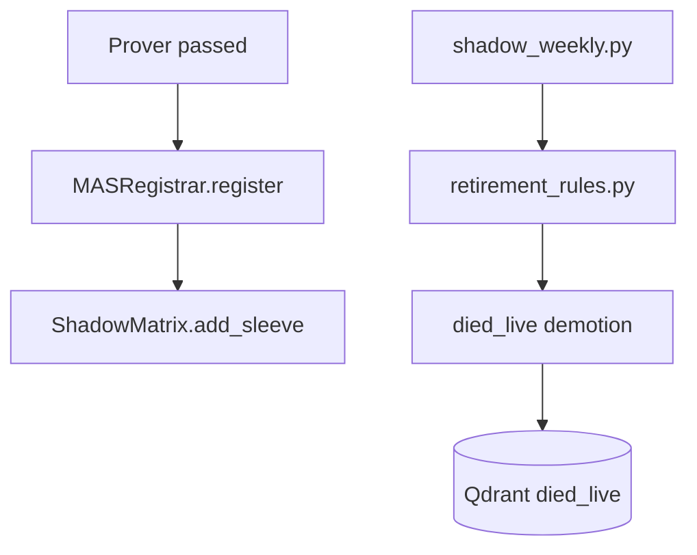

```bash
make shadow-weekly   # paper-trading labels → p_survives_live
```

| Artifact | Path |
|----------|------|
| Registration log | `packages/smse/logs/mas_registrations.jsonl` |
| Shadow state | `data/shadow_matrix.json` |
| Weekly labels | `data/shadow_matrix_labels.jsonl` |

Shadow labels feed Phase 4 metacog training when ≥100 weekly labels exist.

---

## 12. Hybrid SSM–MoE Track (Parallel)

Migration path from Qwen+LoRA to a custom **HybridEngine** — does not block the current flywheel.

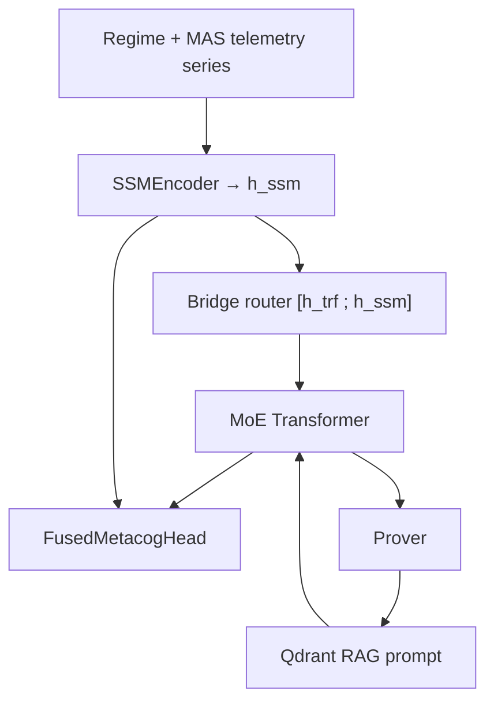

```bash
make hybrid-smoke       # unit tests
make hybrid-generate    # scaffold generation
make hybrid-calibrate   # calibrate head
make enable-hybrid      # switch generator when competitive
```

Full roadmap: [`docs/HYBRID_PHASES.md`](docs/HYBRID_PHASES.md)

---

## 13. End-to-End Workflows

### Corpus growth (Mac — CPU only)

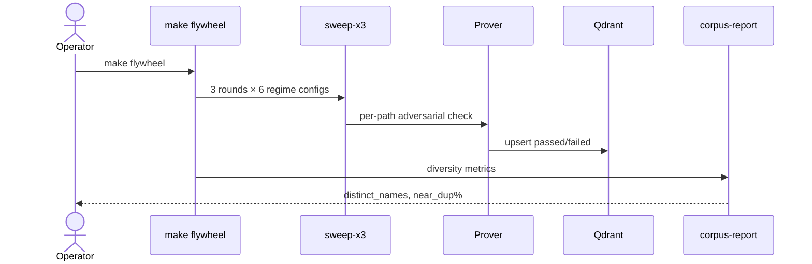

### LoRA train + handoff (Colab GPU)

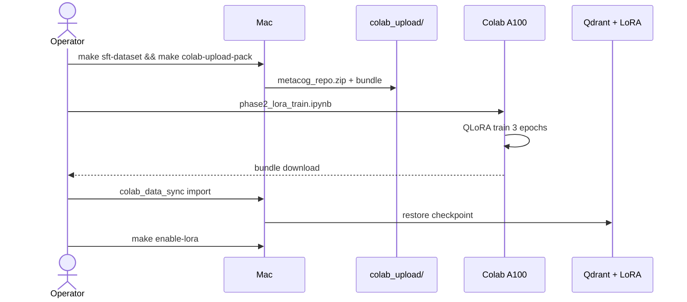

### Phase 3 LLM sweep

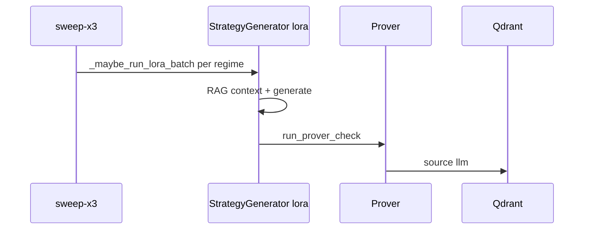

---

## 14. Development & Compute Stack

| Component | Tool | Role |
|-----------|------|------|
| Language | Python 3.10–3.14 | Monorepo |
| Venv | `.venv/` | `make install` |
| Train extras | `.[train]` | torch, peft, transformers |
| Corpus sweeps | Mac CPU | ~2–4 hr per `sweep-x3` |
| QLoRA train | Colab A100 | ~45–90 min |
| Full eval | Colab GPU or 24+ GB Mac | Prover + generation |
| Embeddings | sentence-transformers MiniLM | 384-dim local |
| Orchestration | MCP | `make mcp` |
| Tests | pytest | `make test` |

### Makefile Reference

| Target | Purpose |
|--------|---------|
| `install` | Create venv + install `[dev,smse]` |
| `verify` / `bootstrap` | Memory e2e + schema bootstrap |
| `sweep` / `sweep-x3` | SMSE corpus growth |
| `recover-lve` | LVE lattice toxin recovery |
| `corpus-report` | Diversity metrics + recommendations |
| `flywheel` | sweep-x3 → report → sft → verify → baseline |
| `auto-flywheel` | Loop until distinct target |
| `sft-dataset` | Anti-cheat splits from memory |
| `train` | Local LoRA SFT (GPU) |
| `colab-export` / `colab-upload-pack` | Colab handoff tarball |
| `enable-lora` / `enable-hybrid` | Switch generator mode |
| `eval-checkpoint*` | Checkpoint evaluation variants |
| `train-metacog` | Confidence head from memory |
| `shadow-weekly` | Paper-trading labels |
| `weekly` | flywheel + train-metacog |
| `ablation` | Component ablation harness |
| `mcp` | MCP orchestration server |
| `test` | pytest suite |

---

## 15. Local Development Considerations

### 8 GB Mac — what works and what doesn't

| Task | 8 GB Mac | Colab A100 |
|------|----------|------------|
| SMSE sweeps / flywheel | ✅ | Overkill |
| SFT dataset build | ✅ | — |
| QLoRA train | ❌ | ✅ |
| Full eval-checkpoint | ❌ | ✅ |
| eval-checkpoint-quick | Marginal | ✅ |
| LoRA inference in sweeps | Marginal | Better |

**Tip:** Quit Cursor during heavy inference; use Terminal.app. Minimum for comfortable local LoRA: **24–32 GB** unified memory.

### Common issues

| Issue | Fix |
|-------|-----|
| `pip: command not found` | Use `.venv/bin/pip` or `source .venv/bin/activate` |
| Qdrant lock on `sft-dataset` | Stop flywheel/sweep first |
| `generator_mode: stub` in eval | `pip install -e ".[train]"`; confirm `adapter_config.json` exists |
| Colab `torchao` vs `peft` | `pip uninstall torchao` before train |
| Colab CUDA OOM | Restart session; QLoRA 4-bit; batch=1 |
| Colab BadZipFile | Upload exact `colab_upload/metacog_repo.zip` (~43 MB) |
| Near-dup % > 30% | Tighten `configs/sweep_configs.yaml` diversity params |

---

## 16. Anti-Cheat & Prover ≠ Alpha Hardening

Layered defenses against label gaming and train-set leakage. Most hardening gates default **OFF** during corpus growth.

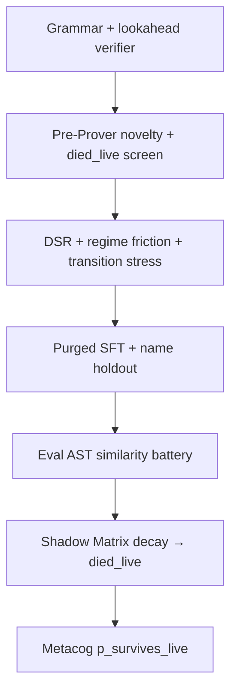

| Layer | Default | Enable when |
|-------|---------|-------------|
| Syntax / DSL grammar | ON | Always |
| Pre-Prover memory gate | ON | Always |
| SFT name holdout + purged split | ON | Always |
| Eval AST cheat battery | ON | Post-train |
| Deflated Sharpe gate | OFF | Post-500, one flag at a time |
| Regime friction | OFF | Post-500 |
| `died_live` pre-Prover screen | OFF | Post-500 |
| Shadow decay demotion | Weekly | After MAS registration |

---

## 17. Design Decisions

| Decision | Rationale |
|----------|-----------|
| SMSE combinator before LLM | Valid DSL without GPU; cheap corpus on Mac CPU |
| 500 gate before serious LoRA | Minimum textbook size; stretch 1,000 for richer RAG |
| Prover passed-only SFT | Failed examples enter RAG for correction, not imitation |
| QLoRA on Colab, sweeps on Mac | 8 GB Mac cannot hold train + eval |
| Three-bucket memory | passed / failed / died_live teach different failure modes |
| Pre-Prover screen | Cuts Prover cost ~3–5× |
| Name holdout + purged time split | Prevents LoRA memorizing names and sweep adjacency |
| Generator mode in yaml | Explicit `smse` / `lora` / `hybrid` without code changes |
| Local Qdrant default | Zero infra for solo dev |
| Feature-flagged Prover hardening | DSR/friction shrink pass rate — measure before enabling |
| Hybrid as parallel track | Qwen LoRA ships Phase 2–3; SSM–MoE replaces only if eval wins |
| Shadow Matrix for live labels | Prover Sharpe ≠ paper survival |

---

## 18. Current Status & Next Steps

### Snapshot (June 2025)

| Metric | Value |
|--------|-------|
| Distinct strategies | 518 |
| Memory records | 4,829 |
| Near-duplicate % | 2.46% |
| LoRA checkpoint | `data/checkpoints/lora_sft/` (QLoRA, Colab) |
| Generator mode | `lora` |
| Phase 1C gate | ✅ Met (505+) |
| Phase 3 `source: llm` | 🔄 In progress (~20 stub-era) |

### Recommended next steps

1. **Eval** — `make eval-checkpoint-quick` on Mac, or full eval on Colab [`phase2_lora_eval.ipynb`](training/colab/phase2_lora_eval.ipynb)
2. **Phase 3 sweeps** — `make sweep-x3` with `mode: lora`; watch `source: llm` grow in `corpus_report.json`
3. **Stretch corpus** — `make auto-flywheel` toward 1,000 distinct
4. **Shadow labels** — `make shadow-weekly` after MAS registrations accumulate
5. **Metacog head** — `make train-metacog` when ≥300 shadow labels exist

### Phase roadmap

| Phase | Goal | Status |
|-------|------|--------|
| 0 | Infrastructure | ✅ |
| 1C | Corpus flywheel ≥500 | ✅ |
| 2 | QLoRA SFT | ✅ (Colab) |
| 3 | LLM in sweeps | 🔄 |
| 4 | Metacog head + self-correction | ⬜ |
| 5 | Ablations | ⬜ |
| 6 | Weekly rhythm | 🔄 |

Full detail: [PHASES.md](PHASES.md) · Architecture deep-dive: [SPEC.md](SPEC.md)

---

## Key Configuration Files

| File | Controls |
|------|----------|
| [`configs/sweep_configs.yaml`](configs/sweep_configs.yaml) | Per-regime sweep parameters |
| [`configs/memory.yaml`](configs/memory.yaml) | Qdrant, retrieval, corpus target |
| [`configs/training.yaml`](configs/training.yaml) | LoRA, SFT splits, metacog |
| [`configs/generator.yaml`](configs/generator.yaml) | smse / lora / hybrid mode |
| [`packages/smse/configs/lattice_config.yaml`](packages/smse/configs/lattice_config.yaml) | Primitives, lattice topology |
| [`packages/smse/configs/prover_config.yaml`](packages/smse/configs/prover_config.yaml) | Adversarial thresholds |

---

*For the full technical specification, see [SPEC.md](SPEC.md).*
