# Metacognitive Fund Strategy Stack
### System Specification

> **Stack:** Python 3.10+ · SMSE (Physarum lattice) · Qwen2.5-Coder-1.5B + QLoRA · Qdrant · MAS · Hybrid SSM–MoE (parallel track)  
> **Approach:** Combinatorial strategy discovery with adversarial Prover labeling, memory-grounded RAG, and closed-loop corpus flywheel  
> **Current milestone:** Phase 1C gate met (505+ distinct) · QLoRA checkpoint trained on Colab · Phase 3 LLM sweeps in progress

---

## Table of Contents

1. [Overview](#1-overview)
2. [The Problem](#2-the-problem)
3. [The Solution](#3-the-solution)
4. [System Architecture](#4-system-architecture)
5. [Strategy Generation Pipelines](#5-strategy-generation-pipelines)
6. [The Adversarial Prover Layer](#6-the-adversarial-prover-layer)
7. [The Corpus Flywheel & Self-Correcting Loop](#7-the-corpus-flywheel--self-correcting-loop)
8. [Memory Store & RAG System](#8-memory-store--rag-system)
9. [Training & Evaluation Pipeline](#9-training--evaluation-pipeline)
10. [MAS Integration & Shadow Matrix](#10-mas-integration--shadow-matrix)
11. [Hybrid SSM–MoE Track (Parallel)](#11-hybrid-ssmmoe-track-parallel)
12. [End-to-End Workflows](#12-end-to-end-workflows)
13. [Development & Compute Stack](#13-development--compute-stack)
14. [Local Development Considerations](#14-local-development-considerations)
15. [Anti-Cheat & Prover ≠ Alpha Hardening](#15-anti-cheat--prover--alpha-hardening)
16. [Design Decisions](#16-design-decisions)

---

## 1. Overview

This repository is a **research and training platform** for discovering, validating, and learning to generate **regime-conditioned trading strategies** expressed in a restricted Python DSL (`BaseMarketStrategy`). The system does not deploy hundreds of live strategies at the corpus gate — it builds a **labeled textbook** of what passes adversarial backtests, then fine-tunes generators to imitate and extend that knowledge.

The platform has five interconnected layers:

- **SMSE (Strategy Mining & Synthesis Engine)** — Physarum-inspired lattice path finder that combinatorially assembles primitives into strategy code without an LLM
- **Adversarial Prover** — Walk-forward backtester, regime Sharpe gates, novelty detection, and optional hardening (DSR, friction, transition stress)
- **FinMem (Qdrant memory)** — Three-bucket store (`passed` / `failed` / `died_live`) with RAG retrieval for generation and SFT dataset construction
- **Metacog generation layer** — Qwen2.5-Coder-1.5B + QLoRA (primary), stub fallback, and future Hybrid SSM–MoE engine
- **MAS (Multi-Asset Sleeve allocator)** — Sleeve registration, portfolio correlation, shadow paper-trading labels for `p_survives_live`

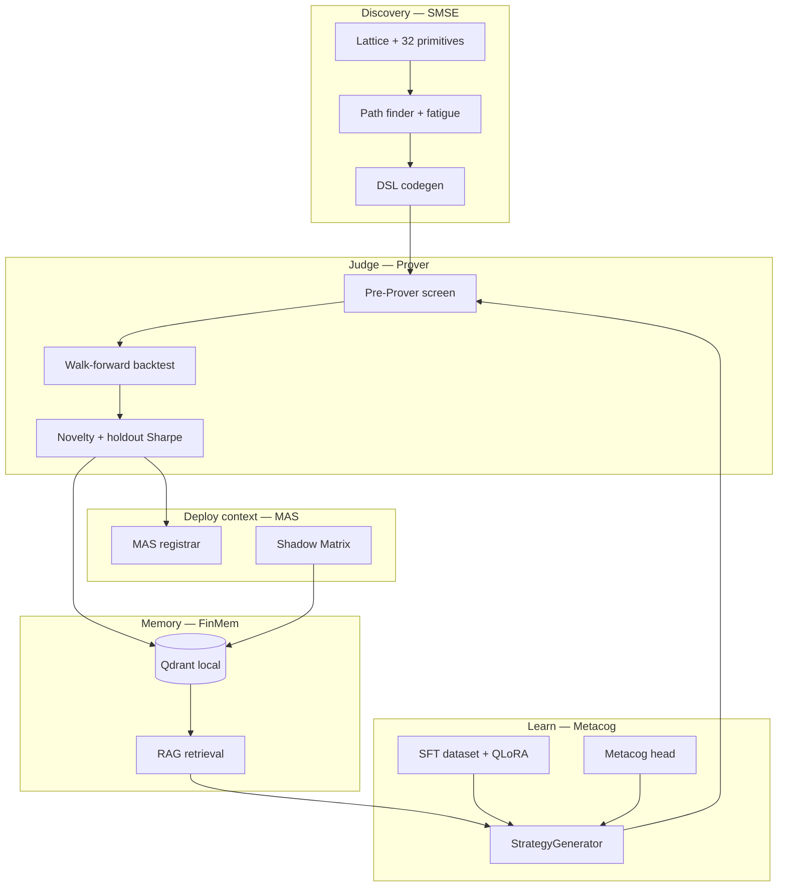

### Monorepo Layout

| Package | Path | Role |
|---------|------|------|
| **smse** | `packages/smse/` | Lattice, primitives, codegen, Prover client, pipeline |
| **metacog** | `packages/metacog/` | Memory, generation, decoding grammar, metacog head, MCP |
| **mas** | `packages/mas/` | Allocation, shadow matrix, retirement rules, validation |
| **hybrid-core** | `hybrid-core/` | SSM encoder, MoE transformer, fused metacog (parallel track) |
| **training** | `training/` | SFT build, LoRA train, eval, Colab notebooks |
| **scripts** | `scripts/` | Sweeps, flywheel, corpus report, Colab sync |

---

## 2. The Problem

Quantitative strategy research faces three coupled failures:

**Discovery bottleneck.** Hand-writing regime-specific strategies does not scale. Random search over unstructured Python produces syntax errors, lookahead bugs, and untradeable noise.

**Validation gap (Prover ≠ Alpha).** In-sample backtest Sharpe is a weak proxy for live survival. Strategies can pass by overfitting, memorizing paths, or exploiting leaky features. A corpus of "passed" labels is worthless if the labeler is gamed.

**Knowledge retention.** Without persistent memory, each sweep rediscovers the same paths. Without a trainable generator, the combinator engine cannot generalize beyond its lattice — and without anti-cheat splits, fine-tuned LLMs memorize SMSE paths instead of learning the DSL.

This project treats **labeled strategy code** as the central artifact: combinatorial growth feeds the Prover, the Prover feeds memory, memory feeds LoRA SFT, and LoRA feeds new sweeps — under explicit gates at every handoff.

---

## 3. The Solution

The platform places a **gated flywheel** between combinatorial search and learned generation:

1. **SMSE** explores a bounded primitive lattice (32 nodes, max 3 primitives per path) with path fatigue, diversity quotas, and pre-Prover novelty screens.
2. **Prover** adversarially labels each candidate with regime Sharpe, drawdown, holdout windows, and failure codes.
3. **Memory** stores outcomes in three FinMem buckets with behavioral fingerprints and decay scores.
4. **SFT + QLoRA** trains Qwen2.5-Coder on Prover-**passed** examples only, with purged time splits and 20% name holdout for cheat detection.
5. **LoRA generator** replaces stub in sweeps, producing `source: llm` strategies that must pass the same Prover gates.

> **Core design decision:** The system does **not** ask an LLM to invent finance from scratch. SMSE provides **ground-truth DSL examples**; the LLM learns to **compose within the grammar** under Prover supervision. The Hybrid track (SSM–MoE) is a parallel bet to replace Qwen later, not a prerequisite for the 500 gate.

### Regime Taxonomy

| ID | Regime | Typical role in corpus |
|----|--------|------------------------|
| **HVC** | HighVol_Contraction | Hardest Prover pass rate; few paths (~3/sweep) |
| **LVE** | LowVol_Expansion | Primary growth driver; most passes |
| **LC** | Liquidity_Crisis | Moderate volume; crisis primitives |

---

## 4. System Architecture

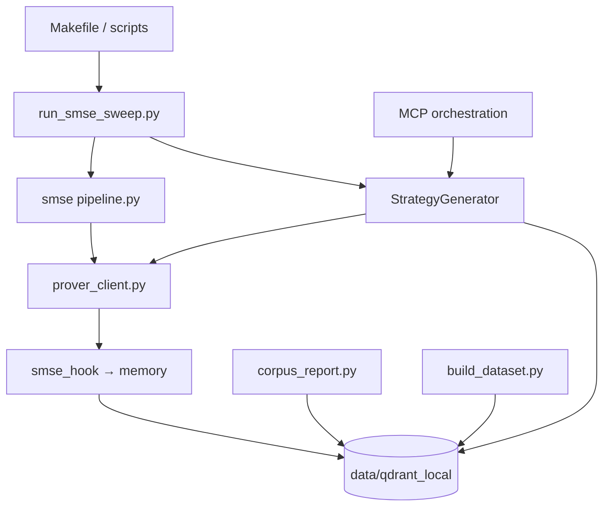

### Communication & Data Flow

| Connection | Mechanism | Purpose |
|------------|-----------|---------|
| Sweep → Pipeline | Python import / `run_pipeline(regime)` | One regime sweep config at a time |
| Pipeline → Prover | `run_prover_check(code, config)` | Adversarial label + metrics |
| Prover → Memory | `upsert_from_prover_result` | Payload v1.0.0 contract |
| Memory → SFT | `scroll_all` + bucket filter | Passed-only JSONL |
| Memory → Generator | `StrategyRetriever` RAG context | passed / failed / died_live examples |
| Colab ↔ Mac | `colab_data_sync.py` tarball | Qdrant + SFT + LoRA checkpoint round-trip |

### Phase Roadmap (Summary)

| Phase | Goal | Gate |
|-------|------|------|
| **0** | Infrastructure, memory schema | `make verify` |
| **1C** | Corpus flywheel | ≥500 distinct, <30% near-dup |
| **2** | QLoRA SFT on Qwen | checkpoint + `sft_stats.ready` |
| **3** | LLM in sweeps | `source: llm` in corpus |
| **4** | Metacog head + self-correction | ≥300 labels, ECE target |
| **5** | Ablations | Component deltas documented |
| **6** | Weekly rhythm | `make weekly` |

Full detail: [`PHASES.md`](PHASES.md) · Hybrid: [`docs/HYBRID_PHASES.md`](docs/HYBRID_PHASES.md)

---

## 5. Strategy Generation Pipelines

Three generator backends are selectable via [`configs/generator.yaml`](configs/generator.yaml):

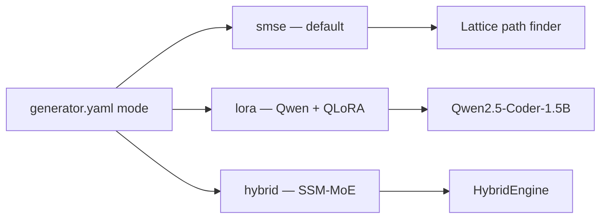

### 5.1 SMSE Combinatorial Pipeline (Primary corpus growth)

**Entry:** `make sweep` / `make sweep-x3` → [`scripts/run_smse_sweep.py`](scripts/run_smse_sweep.py)

**Flow:**

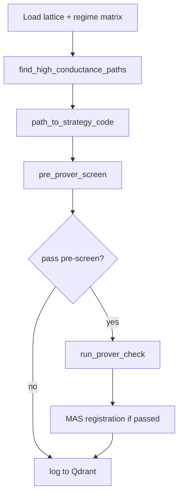

| Stage | File | Function |
|-------|------|----------|
| Path discovery | `path_finder.py` | MMR diversity, family caps, baseline similarity filter |
| Codegen | `codegen.py` | Primitive templates → `BaseMarketStrategy` subclass |
| Pre-Prover | `pre_prover_screen.py` | Syntax, structure, session + Qdrant fingerprint gate |
| Prover | `prover_client.py` | Full adversarial battery |
| Fatigue | `path_fatigue.py` | Conductance tax on repeated edges |

**Sweep configs:** [`configs/sweep_configs.yaml`](configs/sweep_configs.yaml) — per-regime `top_n`, `max_primitives`, `min_diversity_distance`, `pre_prover_max_similarity`.

### 5.2 LoRA LLM Pipeline (Phase 2–3)

**Model:** `Qwen/Qwen2.5-Coder-1.5B-Instruct` + QLoRA adapter at `data/checkpoints/lora_sft/`

**Entry:** `StrategyGenerator` in [`packages/metacog/generation/model.py`](packages/metacog/generation/model.py) — auto-loads LoRA when `adapter_config.json` exists.

| Mode | When | Behavior |
|------|------|----------|
| `stub` | No checkpoint / missing `peft` | Minimal valid DSL placeholder |
| `lora` | Checkpoint + train deps | Full prompt → completion |
| `hybrid` | `generator.yaml mode: hybrid` | `HybridEngine.generate_strategy` |

**Prompt schema** (aligned with SFT):

```
REGIME_{HVC|LVE|LC}
Portfolio: {"HVC":4,"LVE":2,"LC":5,"uncovered":"LVE"}
<BaseMarketStrategy class definition>
{canonical base_strategy.py + RAG context}
---
{completion: strategy class body}
```

### 5.3 Hybrid SSM–MoE Pipeline (Deferred primary)

See [Section 11](#11-hybrid-ssmmoe-track-parallel). Router input: `[token_hidden ; h_ssm ; regime_emb]`. Does not block LoRA path.

---

## 6. The Adversarial Prover Layer

The Prover is the **single source of truth** for whether a strategy enters the `passed` bucket. It is not optional for corpus growth.

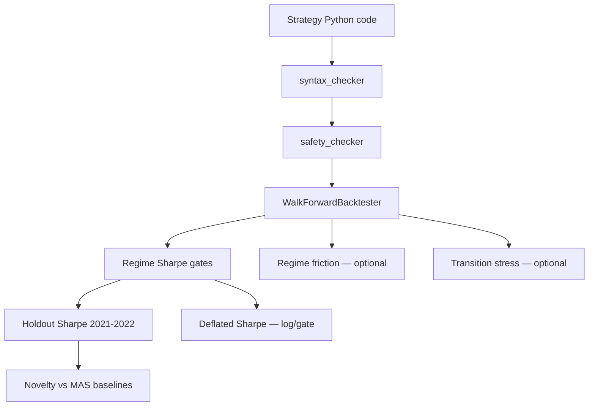

### Configuration

**File:** [`packages/smse/configs/prover_config.yaml`](packages/smse/configs/prover_config.yaml)

| Threshold | Typical value | Notes |
|-----------|---------------|-------|
| `overall_sharpe` | ≥ 0.0 | Global gate |
| `holdout_sharpe` | ≥ 0.15 (regime-specific) | Anti-overfit |
| `max_drawdown_pct` | ≤ 35% | |
| `novelty_score` | ≤ 0.92 similarity | Per-regime overrides |
| `use_deflated_sharpe_gate` | **false** (default) | Enable post-gate gradually |
| `use_regime_friction` | **false** | Cost/haircut multipliers |
| `pre_prover.check_died_live` | **false** | Stricter fingerprint vs died_live bucket |

### Pre-Prover Screen (Fast Gate)

Runs **before** expensive backtests. Rejects duplicates early.

| Check | Code | Threshold |
|-------|------|-----------|
| Syntax / structure | `full_check` | Must pass |
| Baseline fingerprint | `pre_novelty_baseline` | cosine > 0.92 |
| Session fingerprint | `pre_novelty_session` | Same sweep dedup |
| Qdrant memory | `pre_novelty_memory` | cosine > 0.90 default |

**File:** [`packages/smse/src/strategy_extraction/pre_prover_screen.py`](packages/smse/src/strategy_extraction/pre_prover_screen.py)

---

## 7. The Corpus Flywheel & Self-Correcting Loop

The flywheel is the project's core operating rhythm: grow corpus → report → sync SFT → verify → repeat until gates met, then train → eval → sweep with LLM.

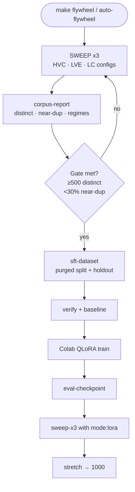

### Gate Metrics (Current Reference)

| Metric | Target | Example (post-1C) |
|--------|--------|-------------------|
| `distinct_names` | ≥ 500 (stretch 1000) | 518 |
| `near_duplicate_pct` | < 30% | 2.46% |
| `code_pairwise_dissimilarity` | ≥ 0.20 | 0.253 |
| `prover_pass_rate` | informational | ~11% |
| `sft_stats.ready` | true, ≥100 train rows | 348 train |

**Reports:** [`data/corpus_report.json`](data/corpus_report.json) · [`data/sft_stats.json`](data/sft_stats.json)

### Lattice Recovery (LVE Stall Recovery)

When LVE paths stagnate, `recover_lve_lattice.py` decays edge toxins and boosts nutrients before LVE sweeps. Invoked automatically in multi-round flywheel.

```bash
make recover-lve
```

---

## 8. Memory Store & RAG System

FinMem implements a **frozen schema v1.0.0** Qdrant collection with three Prover buckets and FinMem decay layers.

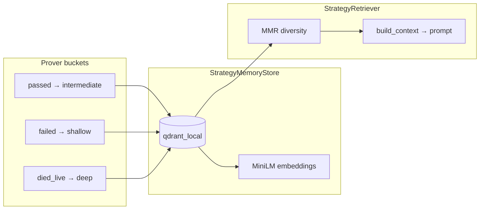

### Schema Highlights

**File:** [`packages/metacog/memory/schema.py`](packages/metacog/memory/schema.py)

| Field | Purpose |
|-------|---------|
| `strategy_id` | UUID primary key |
| `strategy_name` | Distinct count key |
| `prover_bucket` | passed / failed / died_live |
| `prover_sharpe` | Label for metacog head |
| `behavioral_fingerprint` | Duplicate detection |
| `generation_ts` | Purged SFT time split |
| `source` | smse / llm / llm_eval / hybrid |

### Retrieval Config

**File:** [`configs/memory.yaml`](configs/memory.yaml)

```yaml
retrieval:
  passed_k: 5
  failed_k: 3
  died_live_k: 2
  died_live_weight: 2.0
```

Failed and died_live examples are injected on retry for **self-correction** — the model sees what not to repeat.

### Storage Modes

| Mode | Path / command | Use |
|------|----------------|-----|
| Local persistent | `data/qdrant_local/` | **Default** — no Docker |
| Docker Qdrant | `make qdrant` | Payload indexes at scale |
| In-memory | tests only | `make verify` |

---

## 9. Training & Evaluation Pipeline

### 9.1 SFT Dataset Construction

**File:** [`training/sft/build_dataset.py`](training/sft/build_dataset.py)

| Feature | Implementation |
|---------|----------------|
| **Source filter** | `prover_bucket == passed` only |
| **Name holdout** | 20% deterministic hash → `data/sft_holdout_names.json` |
| **Purged time split** | Sort by `generation_ts`; 80% train / 20% val + embargo gap |
| **Outputs** | `sft_dataset.jsonl`, `sft_val.jsonl`, `sft_stats.json` |

```bash
make sft-dataset   # requires flywheel stopped (Qdrant lock)
```

### 9.2 LoRA / QLoRA Training

**Config:** [`configs/training.yaml`](configs/training.yaml)

| Parameter | Value |
|-----------|-------|
| Base model | Qwen2.5-Coder-1.5B-Instruct |
| LoRA rank / alpha | 16 / 32 |
| Epochs | 3 |
| Effective batch | 16 (batch 1 × accum 16 on Colab) |
| Max seq (Colab) | 2048 |

**Colab train:** [`training/colab/phase2_lora_train.ipynb`](training/colab/phase2_lora_train.ipynb) — QLoRA 4-bit, GPU required.

**Mac train:** Not recommended on ≤8 GB unified memory — use Colab.

### 9.3 Evaluation Modes

**File:** [`training/sft/eval_checkpoint.py`](training/sft/eval_checkpoint.py)

| Command | Scope | Mac-safe? |
|---------|-------|-----------|
| `make eval-checkpoint` | Full: 3 regimes + 12 holdout Prover | **No** (8 GB) |
| `make eval-checkpoint-quick` | 3 regimes + 3 holdout AST only | Marginal |
| `make eval-checkpoint-compile` | Compile validity only | Yes |
| Colab `phase2_lora_eval.ipynb` | Full battery on GPU | **Recommended** |

**Eval report:** `data/eval_checkpoint_report.json` — `compile_rate`, `prover_pass_rate`, `ast_cheat_flags`, `phase3_gate`.

---

## 10. MAS Integration & Shadow Matrix

When Prover passes, strategies may register as **MAS sleeves** and enter **paper-trading shadow** tracking.

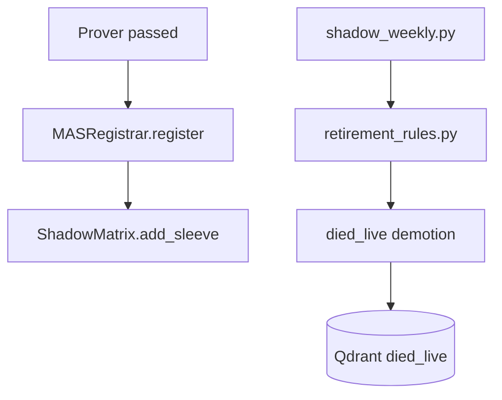

| Component | Path |
|-----------|------|
| Registration log | `packages/smse/logs/mas_registrations.jsonl` |
| Shadow state | `data/shadow_matrix.json` |
| Weekly labels | `data/shadow_matrix_labels.jsonl` |
| Retirement rules | `packages/mas/mas/retirement_rules.py` |
| Correlation gate | `packages/mas/mas/portfolio_correlation.py` |

**Shadow label:** `p_survives_live` from Sharpe decay rate (paper vs Prover). Feeds Phase 4 metacog training when ≥100 weekly labels exist.

```bash
make shadow-weekly
```

---

## 11. Hybrid SSM–MoE Track (Parallel)

Migration path from Qwen+LoRA to a custom **HybridEngine** without blocking the current flywheel.

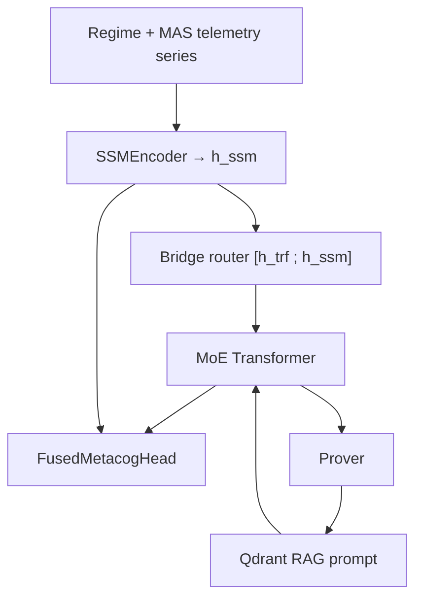

| Phase | Status | Deliverable |
|-------|--------|-------------|
| H0 Memory facade | Done | `MemoryClient` |
| H1 SSM encoder | Done (stub + mamba optional) | `hybrid_core/ssm/` |
| H2 MoE + bridge | Scaffold | `hybrid_core/moe/` |
| H3 Telemetry logging | In progress | `h_trf` / `h_ssm` in generation |
| H4–H6 GRPO + switch | Not started | `hybrid-core/train/grpo.py` |

**Switch criterion:** Hybrid beats LoRA on holdout eval → `make enable-hybrid`

Full roadmap: [`docs/HYBRID_PHASES.md`](docs/HYBRID_PHASES.md)

---

## 12. End-to-End Workflows

### 12.1 Corpus Growth (Mac — CPU only)

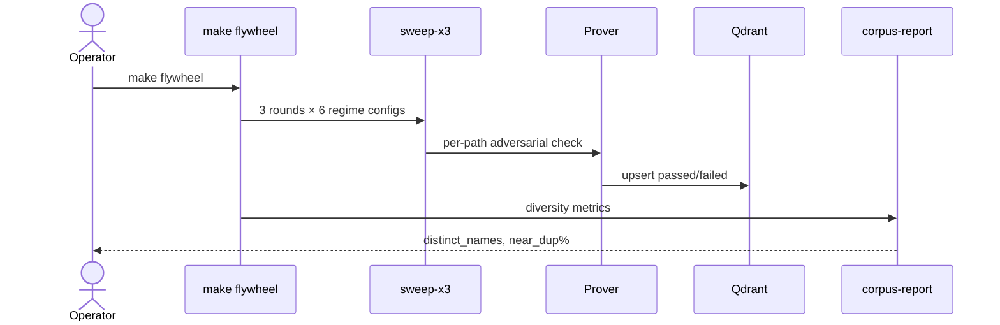

### 12.2 LoRA Train + Handoff (Colab GPU)

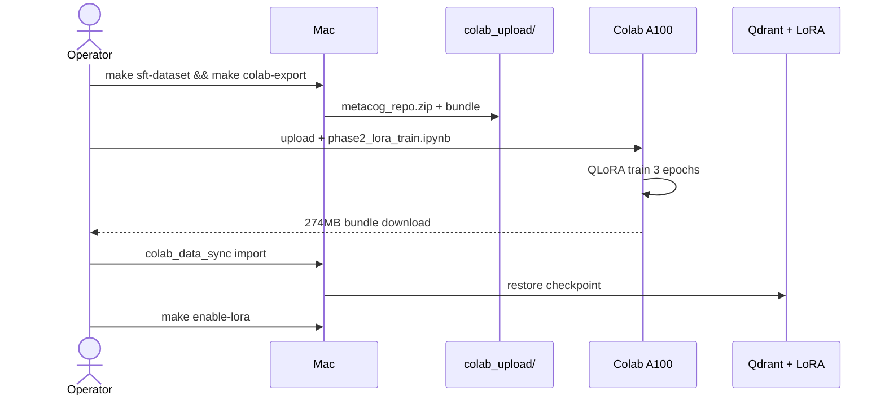

### 12.3 Phase 3 LLM Sweep

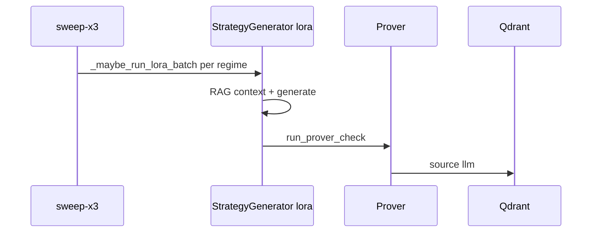

---

## 13. Development & Compute Stack

| Component | Tool / Platform | Role |
|-----------|-----------------|------|
| **Language** | Python 3.10–3.14 | Monorepo |
| **Venv** | `.venv/` | `pip install -e ".[dev,smse]"` |
| **Train extras** | `.[train]` | torch, peft, transformers, accelerate |
| **Hybrid extras** | `.[hybrid]` | hybrid-core, optional mamba-ssm |
| **Corpus sweeps** | Mac CPU | 2–4 hr per sweep-x3 |
| **QLoRA train** | Colab A100 | ~45–90 min |
| **Full eval** | Colab GPU or 24+ GB Mac | Prover + generation |
| **Embeddings** | sentence-transformers MiniLM | 384-dim local |
| **Orchestration** | MCP `make mcp` | External agent tools |
| **Knowledge graph** | graphify `graphify-out/` | Code navigation |

### Makefile Targets (Essential)

| Target | Purpose |
|--------|---------|
| `make flywheel` | sweep-x3 → corpus-report → sft-dataset → verify → baseline |
| `make auto-flywheel` | Loop until distinct target |
| `make sft-dataset` | Anti-cheat splits from memory |
| `make colab-export` / `colab-upload-pack` | Handoff tarball |
| `make enable-lora` | Set `generator.yaml mode: lora` |
| `make eval-checkpoint-quick` | Mac-light eval |
| `make sweep-x3` | Growth + optional LoRA batch |
| `make train-metacog` | Confidence head |
| `make shadow-weekly` | Paper-trading labels |
| `make weekly` | flywheel + metacog refresh |

---

## 14. Local Development Considerations

### 14.1 Unified Memory vs Workload (8 GB Mac)

**Problem:** Qwen 1.5B + LoRA loads ~3–4 GB unified memory. Combined with Cursor, browser, and Qdrant, the system swaps heavily. Full `eval-checkpoint` may run 45–60+ minutes or OOM-kill.

**Fix:**
- Run **QLoRA train and full eval on Colab GPU**
- Use `make eval-checkpoint-quick` or `--compile-only` on Mac
- Quit Cursor during heavy inference; use Terminal.app
- **Minimum recommended hardware:** 24–32 GB unified for local LoRA inference

### 14.2 Qdrant Lock Contention

**Problem:** `build_dataset.py` and `corpus_report.py` fail if flywheel holds `.lock` on `data/qdrant_local/`.

**Fix:** Stop `auto-flywheel` / `sweep` before `make sft-dataset`. Error message: `_QDRANT_LOCK_MSG`.

### 14.3 Colab Dependency Friction

| Issue | Fix |
|-------|-----|
| `torchao` vs `peft` | `pip uninstall torchao` before train |
| Transformers 5 `eval_strategy` | `_training_arguments()` compat shim |
| CUDA OOM on A100 | Restart session; QLoRA 4-bit; batch=1 |
| Truncated zip upload | Verify ~43 MB `metacog_repo.zip`; exact filename |

### 14.4 pip Not on PATH

**Problem:** `pip: command not found` in bare zsh.

**Fix:** Always use venv:

```bash
source .venv/bin/activate
# or
.venv/bin/pip install -e ".[train]"
```

### 14.5 Stub Generator Fallback

**Problem:** `generator_mode: stub` in eval despite checkpoint present.

**Cause:** Missing `peft` / `transformers` in venv.

**Fix:** `pip install -e ".[train]"` then confirm `StrategyGenerator().mode == "lora"`.

---

## 15. Anti-Cheat & Prover ≠ Alpha Hardening

Layered defenses against label gaming and train-set leakage. **Most gates default OFF** during corpus growth; enable one at a time post-500.

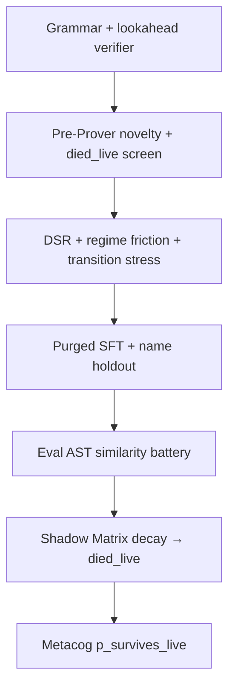

| Layer | Component | Default |
|-------|-----------|---------|
| Syntax / DSL | `syntax_checker`, `decoding/grammar.py` | ON |
| Pre-Prover memory | `memory_novelty_gate.py` | ON |
| died_live screen | `pre_prover.check_died_live` | OFF |
| Deflated Sharpe | `deflated_sharpe.py` | log-only |
| Regime friction | `regime_friction.py` | OFF |
| Transition stress | `transition_stress_test.py` | OFF |
| SFT holdout | `build_dataset.py` | ON |
| Post-train eval | `eval_checkpoint.py` | ON |
| Shadow decay | `shadow_weekly.py` + `retirement_rules.py` | weekly |

---

## 16. Design Decisions

| Decision | Rationale |
|----------|-----------|
| **SMSE combinator before LLM** | Produces valid DSL without GPU; builds labeled corpus cheaply on Mac CPU |
| **500 gate before serious LoRA** | Minimum textbook size; stretch 1000 in `memory.yaml` for richer RAG |
| **Prover passed-only SFT** | Failed examples enter RAG for correction, not imitation |
| **QLoRA on Colab, sweeps on Mac** | 8 GB Mac cannot hold train + eval; split compute by task |
| **Three-bucket memory** | passed / failed / died_live each teach different failure modes |
| **Pre-Prover screen** | Cuts Prover cost ~3–5× by rejecting duplicates early |
| **Name holdout + purged time split** | Prevents LoRA from memorizing strategy names and sweep adjacency |
| **Generator mode in yaml** | Explicit `smse` / `lora` / `hybrid` without code changes |
| **Local Qdrant over Docker default** | Zero infra for solo dev; Docker deferred until >5k records |
| **Feature-flagged Prover hardening** | DSR/friction/transition shrink pass rate — measure before enabling |
| **Hybrid as parallel track** | Qwen LoRA ships Phase 2–3; SSM–MoE replaces only if holdout eval wins |
| **Shadow Matrix for live labels** | Prover Sharpe ≠ paper survival; `p_survives_live` needs decay data |
| **MAS registration on pass** | Links research corpus to allocation context without live deployment at gate |

---

## Appendix A — Key Configuration Files

| File | Controls |
|------|----------|
| [`configs/sweep_configs.yaml`](configs/sweep_configs.yaml) | Per-regime sweep parameters |
| [`configs/memory.yaml`](configs/memory.yaml) | Qdrant, retrieval, corpus target |
| [`configs/training.yaml`](configs/training.yaml) | LoRA, SFT splits, metacog |
| [`configs/generator.yaml`](configs/generator.yaml) | smse / lora / hybrid mode |
| [`packages/smse/configs/lattice_config.yaml`](packages/smse/configs/lattice_config.yaml) | Primitives, lattice topology |
| [`packages/smse/configs/prover_config.yaml`](packages/smse/configs/prover_config.yaml) | Adversarial thresholds |
| [`packages/smse/configs/gradient_config.yaml`](packages/smse/configs/gradient_config.yaml) | Path fatigue, edge toxins |

## Appendix B — Current Snapshot (June 2025)

| Metric | Value |
|--------|-------|
| Distinct strategies | 518 |
| Memory records | 4,829 |
| Prover passes | 530 |
| Near-duplicate % | 2.46% |
| LoRA checkpoint | `data/checkpoints/lora_sft/` (QLoRA, Colab) |
| Generator mode | `lora` |
| Phase 1C gate | Met (505+) |
| Phase 3 LLM in corpus | In progress (`source: llm` ≈ 20 stub-era) |

---

*Specification aligns with [`PHASES.md`](PHASES.md), [`README.md`](README.md), and [`docs/HYBRID_PHASES.md`](docs/HYBRID_PHASES.md). Update Appendix B as gates progress.*
